

# Modane

Written by CEA and Contributors

(C) Copyright 2022, by CEA. All rights reserved.

All content is the property of the respective authors or their employers.
For more information regarding authorship of content, please consult the
listed source code repository logs.

## Introduction

Modane is a design support tool for numerical simulation codes based on [Eclipse](https://www.eclipse.org/).

The continual increasing power of supercomputers allows numerical simulation codes to take into account more complex physical phenomena. Therefore, physicists and mathematicians have to implement complex algorithms using cutting edge technologies and integrate them in large simulators. The CEA-DAM has been studying for several years the contribution of UML/MDE technologies in its simulators development cycle. The Modane application is one of the results of this work.

This program and the accompanying materials are made available under the terms of the Eclipse Public License v. 2.0 which is available at https://www.eclipse.org/legal/epl-v20.html.

SPDX-License-Identifier: EPL-2.0

Please refer to the license for details.

## Getting started

The latest Modane environment can be downloaded [here](https://github.com/cea-hpc/Modane/releases/tag/v1.4.5).

Once the Modane environment has been launched, the Modane perspective should be selected. If it is not the case, just select the Modane perspective from the *Window > Perspective > Open Perspective > Other ... > Modane Project Perspective* menu.

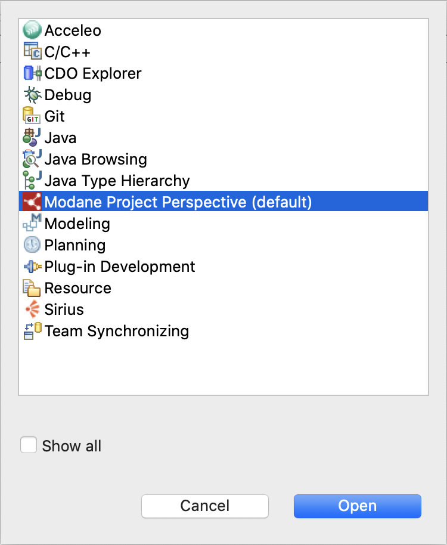

The Modane perspective provides a set of *Views* and wizards shortcuts allowing to easily create and develop Modane models.

### Create a new project

From the *Model Explorer View* in the *Modane* perspective, just right-click and select *New > Modane Project* to create a new project:

You can also create it from the *File > New > Modane Project* main menu.

A new wizard is launched, asking for a project name and a module name:

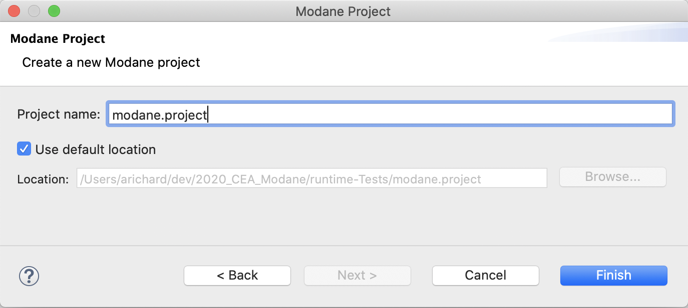

Just click on the *Finish* button to create the new project. The new project is available in the *Model Explorer View*:

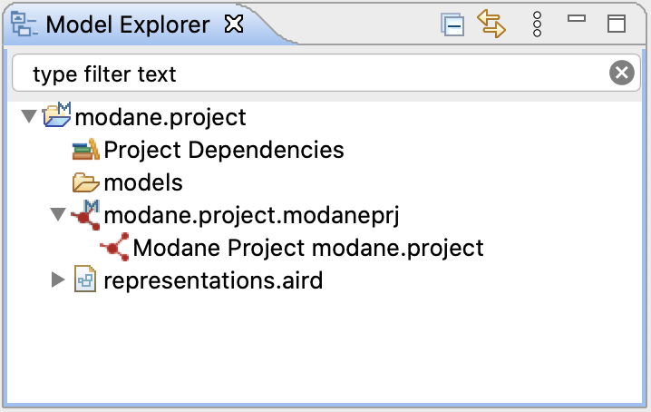

It contains one model (*modane.project.modaneprj*) in the *modane.project* project.

Several commands are accessible from *modane.project.modaneprj*:

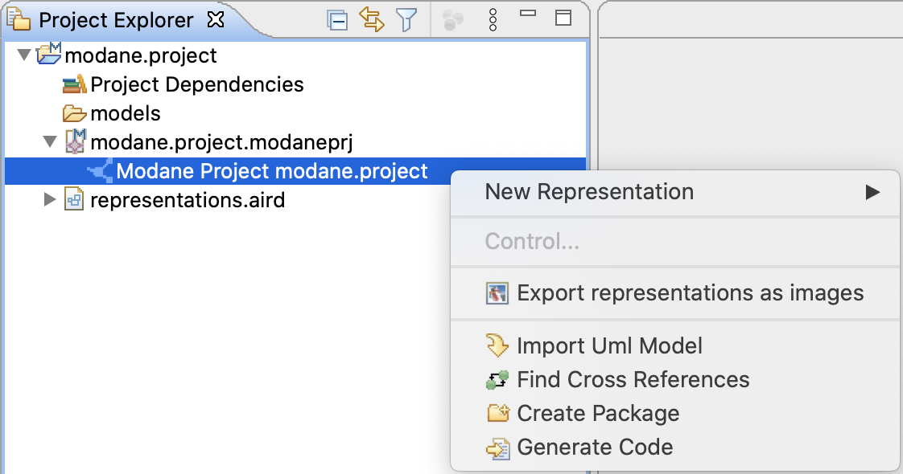

 * New Representation
   * Allows to create diagrams on the selected element. Diagrams available depend on the selected element.
 * Import UML Model
   * The imported UML model will be converted into a Modane model.
 * Find Cross References
   * Cross references will be displayed in the *Search View*.
 * Create Package
   * Create a Modane Package element.
 * Generate Code
   * Generate C++ code corresponding to the Modane Project.

### Examples project

From the *Model Explorer View* in the *Modane* perspective, just right-click and select *New > Modane Examples* to import the examples project:

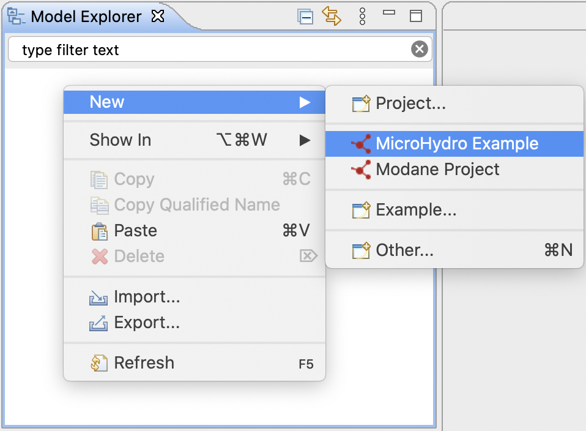

You can also import it from the *File > New > Modane Examples* main menu.

A new wizard is launched:

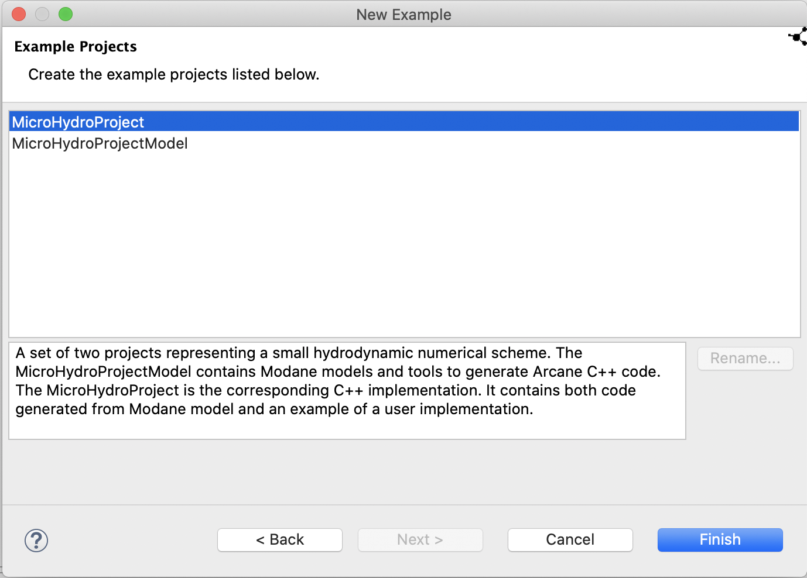

Just click on the *Finish* button to import the examples project. The examples project is available in the *Model Explorer View*:

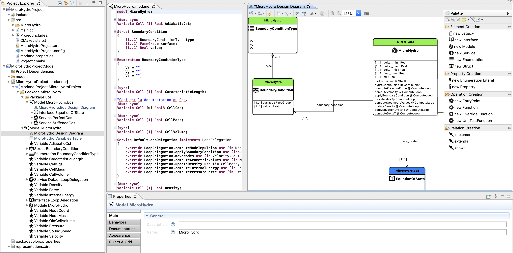

## Modane Preferences

The Modane preferences are accessible through the *Window > Preferences > Modane* (or *Modane > Preferences > Modane* on MacOS) menu.

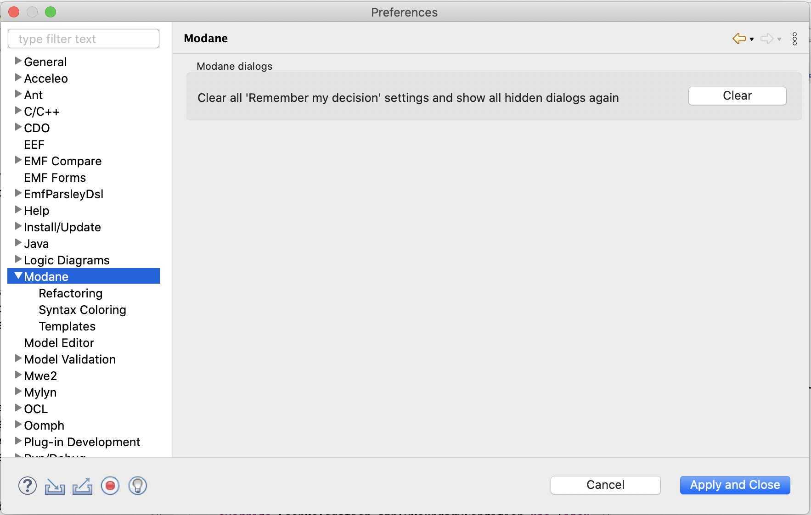

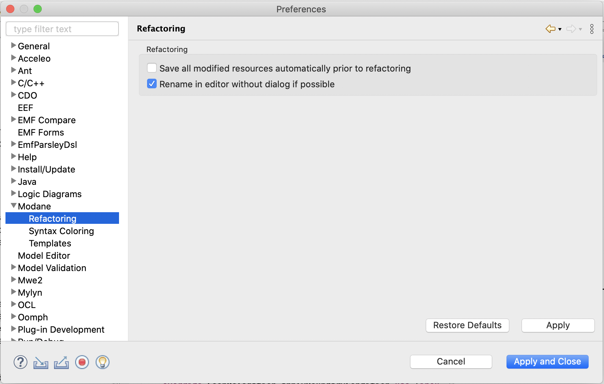

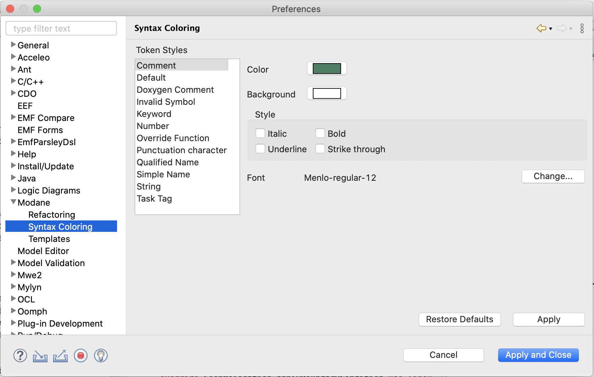

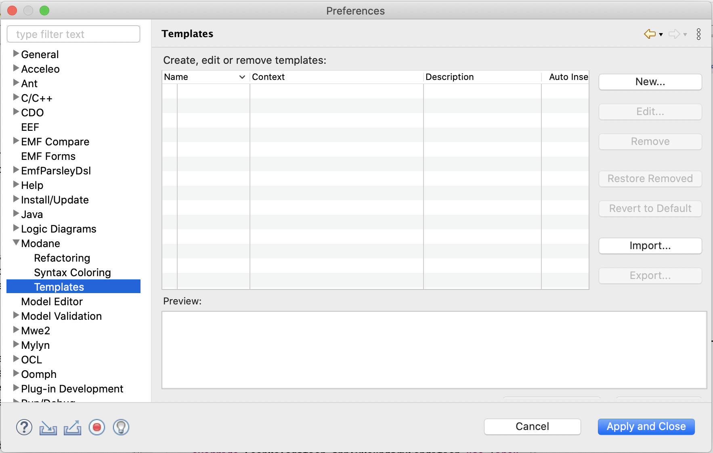

## Build via Maven 3.x

To build the Modane products for Windows/Linux/MacOS and the Eclipse update-site, you can run the following command from the root of the repository:
`mvn clean; mvn verify`.

Note the `';'` after `mvn clean`. 

The products resulting from the build will be accessible in */releng/fr.cea.modane.updatesite/target/products/Modane-version.yyyymmddHHMM-YOUR_PLATFORM.zip*.

The headless products resulting from the build will be accessible in */releng/fr.cea.modane.updatesite/target/products/ModaneHeadless-version.yyyymmddHHMM-YOUR_PLATFORM.zip*.

The Eclipse update-site resulting from the build will be accessible in */releng/fr.cea.modane.updatesite/target/fr.cea.modane.updatesite-version.yyyymmddHHMM.zip*.

Just install this update-site in an Eclipse with Sirius and Xtext already installed to use Modane. The versions of Eclipse, Sirius and Xtext are listed below.

If you want to skip tests execution, you can run the following command:
`mvn clean; mvn verify -Dmaven.test.skip=true`

## Dependencies

Modane requires Java 11.1 or later to build & run. 

It as based on:

Eclipse 2021-09
 * License: EPL-2.0
 * Project: https://www.eclipse.org/downloads/packages/release/2021-09/r

Xtext (2.25.0)
 * License: EPL-2.0
 * Project: http://projects.eclipse.org/projects/modeling.tmf.xtext
 * Source: https://github.com/eclipse/xtext

Sirius (6.5.1)
 * License: EPL-2.0
 * Project: http://projects.eclipse.org/projects/modeling.sirius
 * Source: https://git.eclipse.org/c/sirius/org.eclipse.sirius.git

Amalgam (1.13.0)
 * License: EPL-2.0
 * Update Site: https://download.eclipse.org/modeling/amalgam/updates/stable/1.13.0-S20210909/capella/

JGraphT (1.3.0)
 * License: LGPL-2.1, EPL-2.0
 * Project: http://jgrapht.org
 * Source: https://github.com/jgrapht/jgrapht

